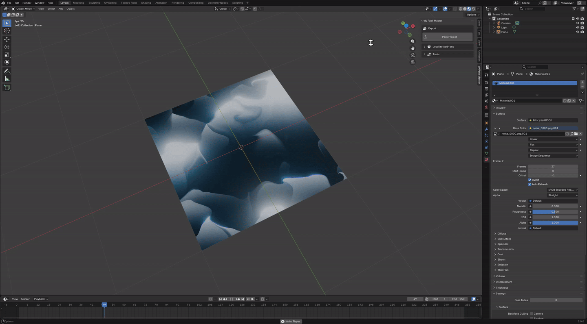
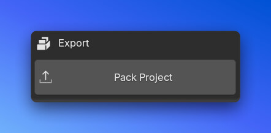
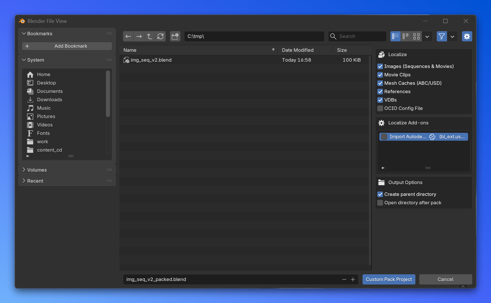
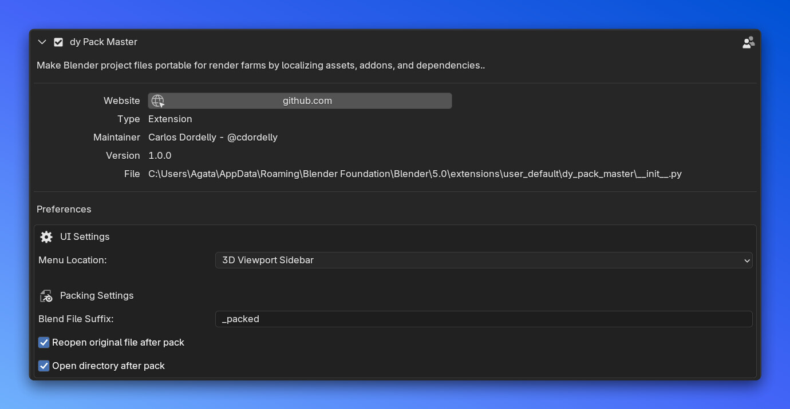
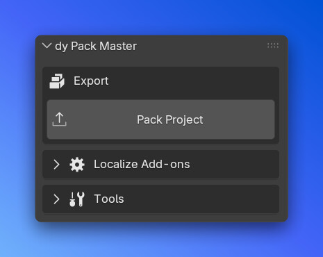
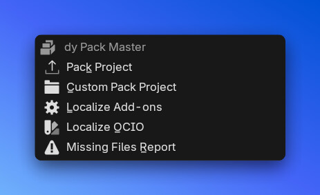

# dy Pack Master


**Make Blender projects portable for render farms by localizing assets, addons, and dependencies.**

`dy Pack Master` is a comprehensive tool designed to prepare your Blender projects for distribution or render farm submission. It automates the tedious process of collecting external assets, relinking them to relative paths, and even packing necessary add-ons.



## Features

### 📦 Pack Project (One-Click)



The main tool that automates the entire packing workflow in one click:
1. Saves the current blend file
2. Creates a new directory with your configured suffix (e.g., `scene_packed/`)
3. Packs all blend file resources *(using vanilla Blender pack function)*
4. Localizes all external assets (images, movies, caches, references, VDBs)
5. Converts all asset paths to relative paths
6. Sets render output to relative path
7. Generates a missing files report
8. Optionally reopens the original file and opens the output directory

### 🎛️ Custom Pack Project



Configure specific localization steps and addon selections before starting the packing process:
- **File browser** to choose output location and filename
- **Toggle individual localization steps** on/off:
  - Images (Sequences & Movies)
  - Movie Clips (Video Editor)
  - Mesh Caches (ABC/USD)
  - References (Linked .blend files)
  - VDBs (Volume files)
  - OCIO Config File
- **Select add-ons** to localize from a list
- **Output options**:
  - Create parent directory (e.g., `my_file/my_file.blend`)
  - Open directory after pack

### 📁 Asset Localization
Automatically copy external files to local subdirectories and relink them using relative paths `//`.

- **Images & Movies**: Image sequences and movie files from texture nodes
  - Sequences -> `//sequences/`
  - Movies -> `//movies/`
- **Movie Clips**: Video editor clips -> `//movies/`
- **Alembic & USD**: Detects `MESH_SEQUENCE_CACHE` modifiers
  - `.abc` files -> `//abc/`
  - `.usd`, `.usda`, `.usdc` files -> `//usd/`
- **OpenVDB**: Detects Volume objects
  - Handles single files and **sequences** automatically
  - Copies to `//vdb/`
- **Linked Libraries**: Localizes linked `.blend` files
  - Handles duplicate filenames by auto-renaming
  - Copies to `//references/`
- **OCIO Configuration**:
  - Copies your current OCIO configuration (from environment variable)
  - Generates `set_OCIO_env.bat` and `.sh` scripts to easily set the environment on the farm
  - Copies to `//ocio/`

### 🧩 Localize Add-ons
Bundle specific enabled add-ons with your project to ensure they are available on the render farm.
- **UI List**: Select which enabled add-ons to pack
- **Auto-Zip**: Automatically zips the add-on folders
- **Exclusion List**: Safely ignores core Blender add-ons (You can customize the exclusion list if needed by editing file: `dy_pack_master/addons_exclusion_list.txt`)
- Copies to `//addons/`

### 🛠️ Tools
- **Localize OCIO**: Standalone tool to copy OCIO configuration and generate environment scripts
- **Missing Files Report**: Scans for missing images, libraries, and caches and generates a text report (`missing_files.txt`)

### 📋 Pack Log
Every pack operation generates a detailed `pack_log.txt` file containing:
- Date and time
- OS and Blender version
- Source file path
- Pack directory
- OCIO configuration
- Step-by-step progress log

## Installation

### Blender 4.2 and later (Extensions)
1. Download the repository or release
2. Drag and drop `dy_pack_master` into Blender, or install via **Preferences > Get Extensions > Install from Disk**

### Legacy Installation (Blender 4.0 - 4.1)
1. Zip the `dy_pack_master` folder
2. Go to **Preferences > Add-ons > Install...** and select the zip file

## Preferences

Access addon preferences in **Edit > Preferences > Add-ons > dy Pack Master**.



### UI Settings
- **Menu Location**: Choose where the addon tools appear:
  - **3D Viewport Sidebar** (default): Tools appear in the N-Panel
  - **File > Export**: Tools appear in the File > Export menu

### Packing Settings
- **Blend File Suffix**: Customize the suffix added to your packed blend file (default: `_packed`)
  - Example: `scene.blend` → `scene_packed/scene_packed.blend`
- **Reopen original file after pack**: Automatically reopen the original blend file after packing (default: enabled)
- **Open directory after pack**: Open the output folder in file explorer after packing (default: enabled)

## UI Locations

### 3D Viewport Sidebar



When set menu location to 3D Viewport Sidebar, tools appear in the N-Panel under "dy Pack Master" tab:
- **Export**: Main Pack Project button
- **Localize Add-ons**: Collapsible section with add-on list and localize button
- **Tools**: Collapsible section with Custom Pack Project, Localize OCIO, and Missing Files Report

### File > Export Menu



When set menu location to File > Export, all tools appear in the File > Export menu:
- Pack Project
- Custom Pack Project
- Localize Add-ons (opens popup dialog)
- Localize OCIO
- Missing Files Report

## Python Scripting

You can use the individual operators in your own Python scripts or automation workflows:

```python
import bpy

# Main pack operators
bpy.ops.dy_pack_master.pack_project()
bpy.ops.dy_pack_master.custom_pack_project('INVOKE_DEFAULT')

# Individual localization operators
bpy.ops.dy_pack_master.localize_mesh_cache()
bpy.ops.dy_pack_master.localize_vdb()
bpy.ops.dy_pack_master.localize_references()
bpy.ops.dy_pack_master.localize_ocio()
bpy.ops.dy_pack_master.localize_addons()
bpy.ops.dy_pack_master.localize_images()
bpy.ops.dy_pack_master.localize_movieclips()

# Utility operators
bpy.ops.dy_pack_master.missing_files_report()
bpy.ops.dy_pack_master.refresh_addons()
```

## Output Directory Structure

After packing, your project will have a structure like:

```
scene_packed/
├── scene_packed.blend
├── pack_log.txt
├── sequences/          # Image sequences
├── movies/             # Movie files
├── abc/                # Alembic caches
├── usd/                # USD caches
├── vdb/                # OpenVDB files
├── references/         # Linked .blend files
├── ocio/               # OCIO config (if enabled)
│   ├── config.ocio
│   ├── set_OCIO_env.bat
│   └── set_OCIO_env.sh
└── addons/             # Zipped add-ons (if selected)
```

## Support

If you find this tool useful, consider supporting its development!

[**☕ Buy me a coffee / Donate**](https://www.paypal.com/paypalme/cdordelly)

## License
This project is licensed under the GPL-3.0 License - see the LICENSE file for details.

## Author
Carlos Dordelly - @cdordelly