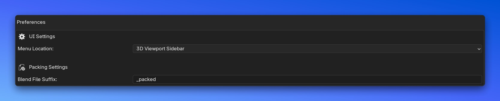
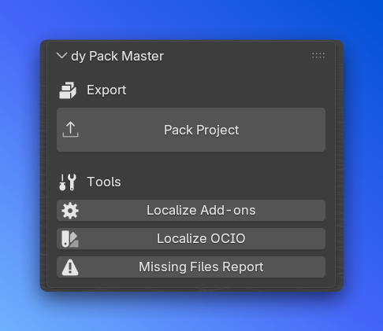
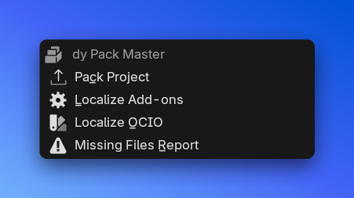

# dy Pack Master

**Make Blender projects portable for render farms by localizing assets, addons, and dependencies.**

`dy Pack Master` is a comprehensive tool designed to prepare your Blender projects for distribution or render farm submission. It automates the tedious process of collecting external assets, relinking them to relative paths, and even packing necessary add-ons.

## Features

### 📦 Asset Localization
Automatically copy external files to local subdirectories and relink them using relative paths (`//`).

*   **Alembic & USD**: Detects `MESH_SEQUENCE_CACHE` modifiers.
    *   `.abc` files -> `//abc/`
    *   `.usd`, `.usda`, `.usdc` files -> `//usd/`
*   **OpenVDB**: Detects Volume objects.
    *   Handles single files and **sequences** automatically.
    *   Copies to `//vdb/`
*   **Linked Libraries**: Localizes linked `.blend` files.
    *   Handles duplicate filenames by auto-renaming.
    *   Copies to `//references/`
*   **OCIO Configuration**:
    *   Copies your current OCIO configuration (from environment variable).
    *   Generates `set_OCIO_env.bat` and `.sh` scripts to easily set the environment on the farm.
    *   Copies to `//ocio/`

### 🧩 Add-on Packing
Need to send custom add-ons to the farm?
*   **Floating UI**: Select which enabled add-ons to pack.
*   **Auto-Zip**: Automatically zips the add-on folders.
*   **Exclude List**: Safely ignores core Blender add-ons.
*   Copies to `//addons/`

### 🛠️ Utilities
*   **Missing Files Report**: Scans for missing images, libraries, and caches and generates a text report.
*   **Set Relative Output**: Quickly sets your render output path to `//render/` while keeping your filename.

## Installation

### Blender 4.2 and later (Extensions)
1.  Download the repository or release.
2.  Drag and drop `dy_pack_master` into Blender, or install via Preferences > Get Extensions > Install from Disk.

### Legacy Installation
1.  Zip the `dy_pack_master` folder.
2.  Go to Preferences > Add-ons > Install... and select the zip file.

## Preferences

Access addon preferences in **Edit > Preferences > Add-ons > dy Pack Master**.


### Menu Location
Choose where the addon tools appear:
- **3D Viewport Sidebar** (default): Tools appear in the N-Panel.

- **File > Export**: Tools appear directly in the File > Export menu.


### Blend File Suffix
Customize the suffix added to your packed blend file (default: `_packed`)

Example: `scene.blend` → `scene_packed.blend`

## Python Scripting

You can use the individual operators in your own Python scripts or automation workflows:

```python
import bpy

# Call operators directly
bpy.ops.dy_pack_master.pack_project()
bpy.ops.dy_pack_master.localize_vdb()
bpy.ops.dy_pack_master.localize_references()
bpy.ops.dy_pack_master.localize_mesh_cache()
bpy.ops.dy_pack_master.localize_ocio()
bpy.ops.dy_pack_master.missing_files_report()
```

## Support

If you find this tool useful, consider supporting its development!

[**☕ Buy me a coffee / Donate**](https://www.paypal.com/paypalme/cdordelly)
